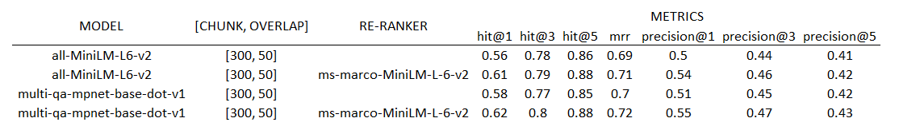

# EvalRAG

**Embedding Model Evaluation for Retrieval-Augmented Generation (RAG)**

## 📌 Overview
This project aims to benchmark different text embedding models within a **Retrieval-Augmented Generation (RAG)** framework.  
By comparing retrieval and answer generation performance across multiple datasets, the project provides insights into the strengths and weaknesses of various embeddings in real-world QA scenarios.
This is a **self-learning project** designed to explore the research process in NLP.

## 🎯 Objectives
- Build a reproducible RAG evaluation framework  
- Compare multiple embedding models (e.g., `all-MiniLM-L6-v2`, `multi-qa-mpnet-base-dot-v1`)  
- Evaluate performance on standard datasets 
- Metrics: Recall@k, MRR, Answer F1, Human evaluation (TBD)

## 📂 Project Structure (TBD)
EvalRAG/
│── data/
    |── corpus.json # original dataset
    |── index1.index # index using `all-MiniLM-L6-v2`, chunk size = 200, overlap = 50
    |── index2.index # index using `all-MiniLM-L6-v2`, chunck size = 300, overlap = 50
    |── metadata2.pkl # chunks from index2
    |── index3.index # index using `multi-qa-mpnet-base-dot-v1`, chunk size = 300, overlap = 50
│── notebooks/ # Experiment notebooks
│── README.md # Project documentation

## Data Source
data used come from repo: https://github.com/yixuantt/MultiHop-RAG/tree/main

## 📝 Self-Learning Log
| Date / Phase | What I Did | What I Learned | Next Steps | Things to Explore Further |
| ------------ | ------------------------- | ---------------------------------------------------------------- | -------------------------------------------------------------- | ---------------------------------------------------------- |
| 2025-09-22 | Found a prepared dataset (mentioned above); Created a basic RAG infrastructure which can split chunks, create index, and generate answers based on llm; | basic steps for RAG | -[x] create metrics for evaluation of results | -[x] theory knowledge for transformers   -[ ] theory knowledge for FAISS
| 2025-09-23 | Created basic evaluation framework, include retrieval metrics hit@k, mrr, and generation metrics meteor | basic metrics for RAG | -[x] try to improve retrieval quality | -[x] Deep dive into metrics meteor, is it suitable? any better choice? |
| 2025-09-28 | Add re-ranker to improve retrieval quality; Change chunk size to improve retrieval quality   Add embedding metrics for generation; Add precision metrics for retrieval; | Logic of re-ranker | -[x] Compare retrieval metrics of 2 different embedding models   -[ ] How to fine-tune model using my dataset | |

## Evaluation

